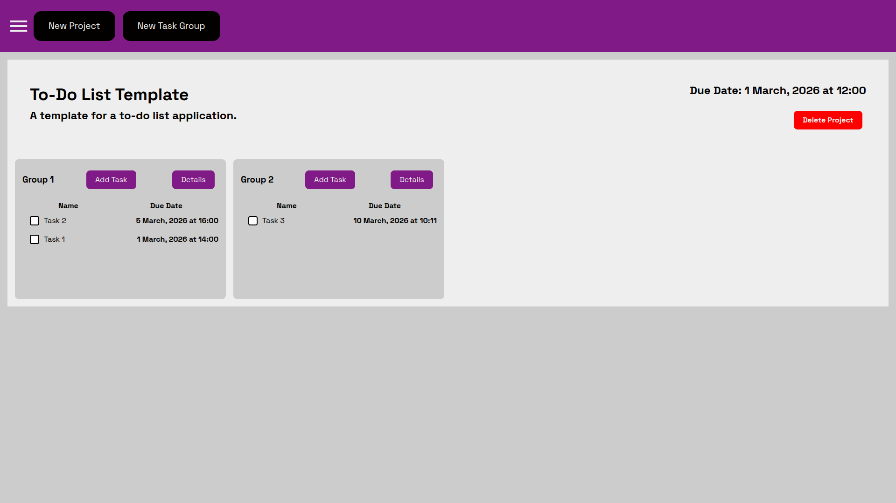
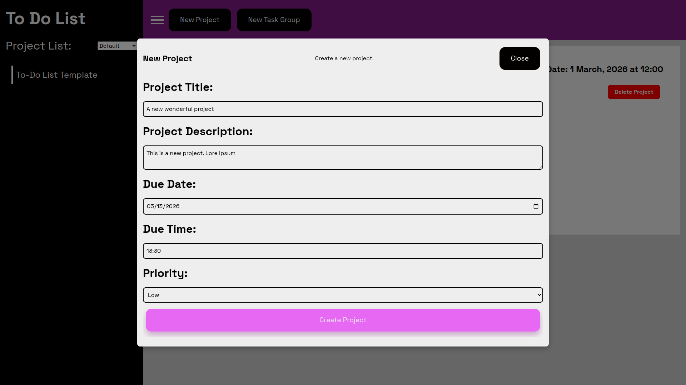
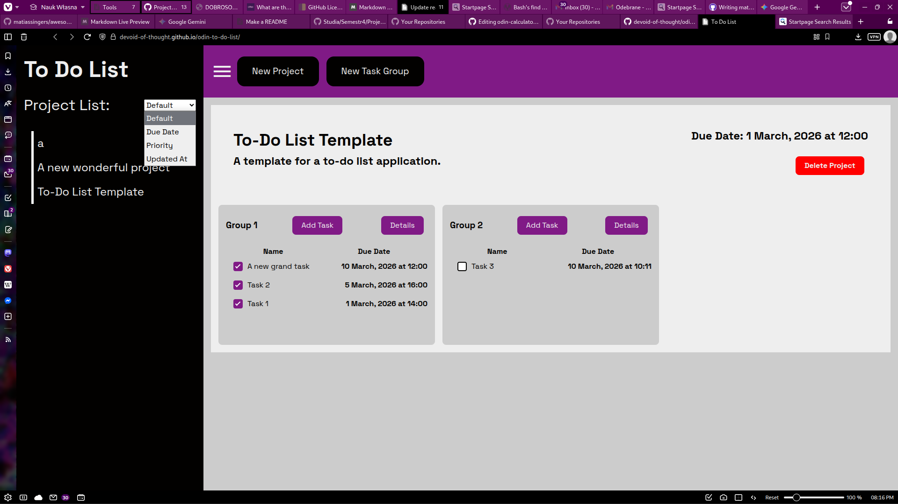
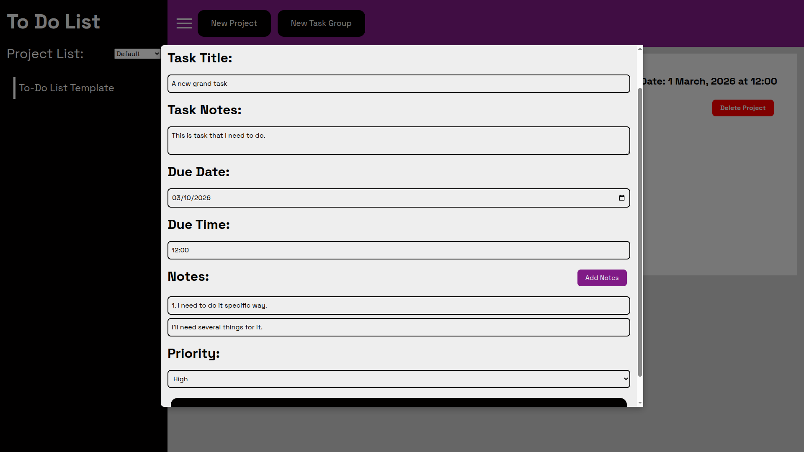
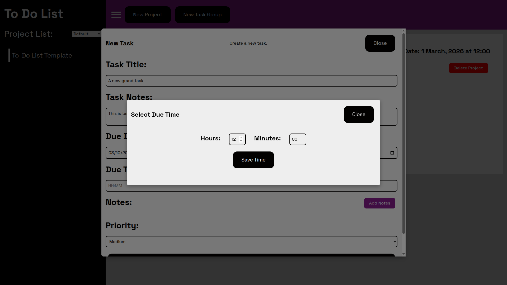
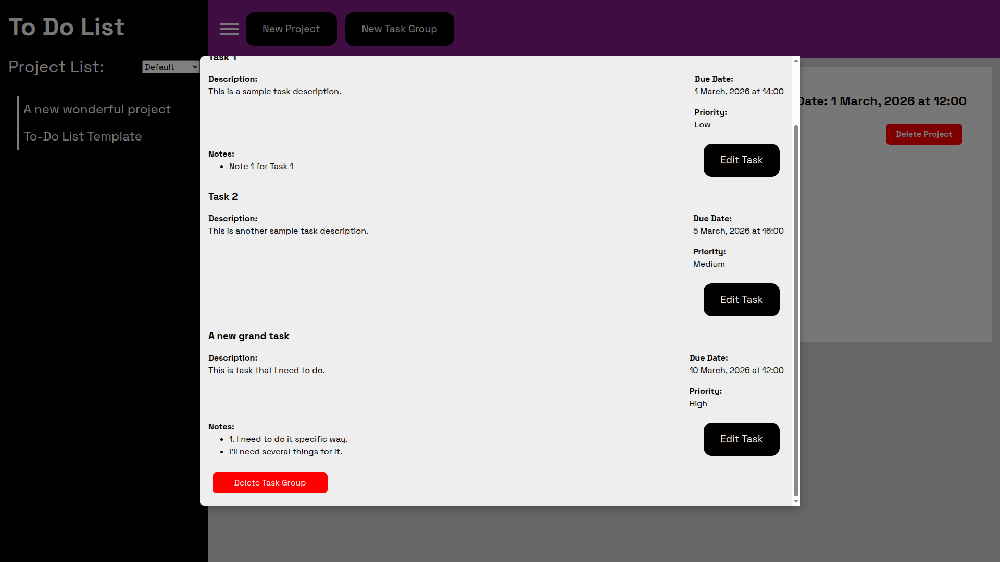

# To Do List

Project created for **[Project Odin](https://www.theodinproject.com/lessons/node-path-javascript-todo-list)**

## Features 
 
**To Do List** web application made with **HTML**, **CSS**, vanilla **JS** and **Webpack**.

**Task** are organized into **Task Groups** which are contained inside **Projects**. You may create a new **Task Group** or **Project** by clicking button a the top of the page.  A new **Task Group** will appear in currently active **Project**. A new **Project** will become **Active Project** upon creation. 
 

You may access **Projects** in the sidebar and sort them based on **Due Time**, **Priority** or which one was **Updated Last**.

A new **Task** is created by clicking button **Add Task** inside taskgroup and will appear inside said taskgroup. 

 

To pick time click **Due Time** input. A dialog shoul pop up where you can insert specific time in hours and minutes.

 

To see details of your **Tasks**, edit or delete go inside **Task Group** details. You may also delete your **Task Group** there.

**Projects** are stored in **JSON** and then saved inside local storage of your browser. So next time you open the app information should persist.

## Live Preview 

To see this website live click this **[Link](https://devoid-of-thought.github.io/odin-to-do-list/)**